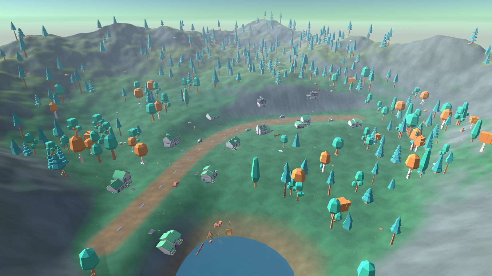
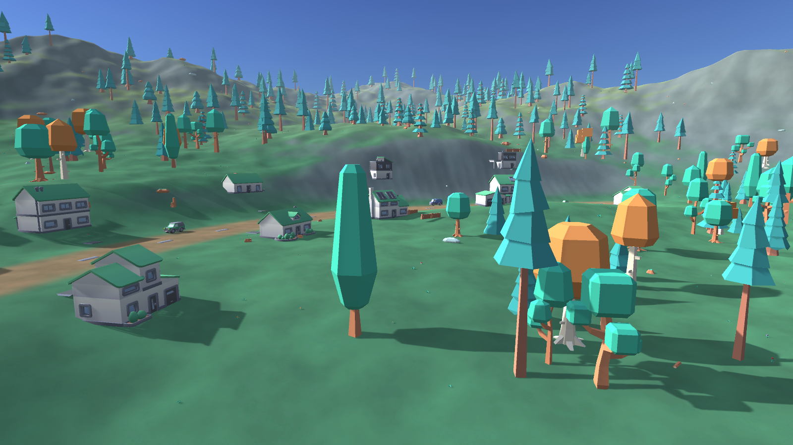
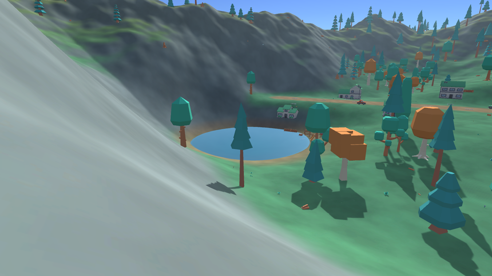

# Hillside Village Overlook, Unity Week 1

**Unity 6000.4.7f1 · Built-In Render Pipeline · Windows**

A single 3D scene built for Week 1 of the Unity internship: a sculpted terrain valley with a
village strung along a dirt road, forested slopes rising to rocky peaks, a lake, a campsite and
parked vehicles. Everything in the scene is generated by a committed Editor tool, so the whole
result is reproducible from source.



---

## 1. Opening the project

1. Open Unity Hub → **Add** → select the `Week1_HillsideVillage` folder.
2. Open with **Unity 6000.4.7f1**. First import takes about a minute.
3. Open `Assets/_Project/Scenes/HillsideVillage.unity`.
4. Press **Play**, the camera slowly orbits the village. Left/right arrows nudge the orbit.

To regenerate the scene from scratch: **Tools → Week 1 → Build Hillside Village Scene**.
This wipes the current scene and rebuilds it deterministically.

---

## 2. Folder structure

```
Week1_HillsideVillage/
├─ Assets/
│  ├─ _Project/                      ← all first-party work
│  │  ├─ Art/
│  │  │  ├─ Materials/               M_Sky_Afternoon, M_Water
│  │  │  └─ Textures/Terrain/        T_GrassMeadow, T_GrassDry, T_DirtPath, T_RockCliff
│  │  ├─ Prefabs/
│  │  ├─ Scenes/                     HillsideVillage.unity
│  │  ├─ Scripts/
│  │  │  ├─ Editor/                  SceneBuilder.cs  (editor-only tool)
│  │  │  └─ Runtime/                 OrbitCameraController.cs  (ships in a build)
│  │  ├─ Settings/
│  │  └─ Terrain/
│  │     ├─ Layers/                  TL_*.terrainlayer
│  │     └─ HillsideTerrain.asset
│  └─ ThirdParty/                    ← external assets, quarantined
│     ├─ Kenney_NatureKit/
│     ├─ Kenney_CityKitSuburban/
│     ├─ Kenney_SurvivalKit/
│     ├─ Kenney_CarKit/
│     └─ LICENSES.md
├─ Docs/                             report, PDF, screenshots
├─ Tools/                            gen_terrain_textures.py
└─ README.md
```

### The conventions, and why

**`_Project/` versus `ThirdParty/` is the important split.** Everything I wrote lives under
`_Project/`; everything downloaded lives under `ThirdParty/`. This matters in practice: when a
third-party pack needs updating, you delete and replace one folder without ever touching your own
work, and in code review the diff makes it obvious which changes are yours. The leading
underscore sorts `_Project` to the top of the Project window, above the alphabetical third-party
folders.

**`Scripts/Editor/` versus `Scripts/Runtime/` is not cosmetic.** Unity treats any folder named
`Editor` specially: its contents compile into a separate editor-only assembly and are *excluded
from builds*. `SceneBuilder.cs` uses `UnityEditor` APIs, so a build would fail to compile if it
sat anywhere else. `OrbitCameraController.cs` runs in the game, so it must not be in `Editor/`.

**Prefixes name the type, so assets sort by kind:** `T_` textures, `M_` materials,
`TL_` terrain layers. Folders are `PascalCase`, matching Unity's own conventions.

---

## 3. Assets

| Pack | Author | Licence | Models used |
|---|---|---|---|
| Nature Kit | Kenney | CC0 | 47 |
| City Kit (Suburban) | Kenney | CC0 | 17 |
| Survival Kit | Kenney | CC0 | 10 |
| Car Kit | Kenney | CC0 | 8 |

Four distinct free packs, against a required minimum of three. Full attribution and source URLs
are in `Assets/ThirdParty/LICENSES.md`.

I chose CC0 deliberately. CC0 is public-domain dedication with no attribution requirement and no
restrictions, so there is nothing to get wrong. The packs are also stylistically consistent with
one another, flat-shaded low-poly with a shared palette, which matters more for a coherent
scene than any individual model's quality.

Only the models the scene actually uses are committed (82 of 499), and only in FBX, since each
pack ships the same geometry five times over in FBX, OBJ, GLB, DAE and STL.

### Terrain textures are generated, not downloaded

My first plan was photoreal CC0 ground textures from ambientCG. I abandoned that after thinking
about it: photographic grass under flat-shaded cartoon trees looks wrong, and art-direction
consistency beats per-texture fidelity. Instead `Tools/gen_terrain_textures.py` generates four
tileable textures using **colour values read out of the Kenney kits' own `.mtl` files**, so the
ground is in the same palette as the models standing on it. The script uses tileable value-noise
fBm and self-checks that each output actually tiles and is not a flat fill.

---

## 4. Scene design

The layout is built around one idea: **the viewer should always be looking at something, and
never at the edge of the world.**

- **Enclosed valley.** Terrain height rises toward every map edge, so the terrain boundary is
  never visible from inside the playable area. This is more robust than hiding the edge with fog,
  which fails the moment the camera moves.
- **A road as the spine.** The village is not a random cluster of houses; 11 houses alternate
  along both sides of a curving road, each rotated to face it, each with a driveway. The road is
  painted into the terrain splatmap rather than built from tiles, so it follows the curve exactly.
- **Height tells a story.** Village on a flattened plateau, lake in a carved basin below it,
  forest on the mid slopes, bare rock on the peaks.
- **Density varies.** Tree placement is driven by noise raised to a power, producing dense stands
  with open meadows between, rather than an even sprinkle. Placement is excluded near houses, the
  road, the water, and slopes over 34°.

954 objects total: 420 trees, 130 rocks, 300 ground details, 11 houses, 6 vehicles, a campsite.



---

## 5. Lighting

Realtime, no baked lightmaps:

| Setting | Value | Reason |
|---|---|---|
| Directional light | 1.0 intensity, warm white, 34° elevation | Low afternoon sun; long shadows reveal terrain relief |
| Shadows | Soft, strength 0.72 | Hard shadows read badly on flat-shaded low-poly |
| Skybox | `Skybox/Procedural`, atmosphere 0.82 | Sky colour derives from the actual sun direction |
| Ambient | Trilight (sky / equator / ground) | Shadowed faces pick up cool skylight instead of going black |
| Fog | Linear, 150 → 600, pale blue | Aerial perspective; distant ridges recede |

**Why no lightmap bake.** This scene is almost entirely static, so baking is the textbook choice.
I chose not to: a full GI bake needs far more free memory than the development machine had
available, and the realistic outcome was a bake that thrashed or never finished. Realtime
directional lighting with Trilight ambient and fog gives a scene that reads correctly, builds in
seconds, and is honest about its constraints. The static flags are all set correctly, so a bake
is a one-click change if a machine with more headroom is available.

The skybox's ground colour is set to match the fog rather than a natural brown, because at some
camera angles the sky below its own horizon line is visible above the mountains, and a brown band
there looks like a bug.

---

## 6. Approach: the scene is generated, not hand-placed

`Assets/_Project/Scripts/Editor/SceneBuilder.cs` (~480 lines) builds the entire scene:
terrain heightmap, texture painting, all object placement, lighting, camera, and four rendered
screenshots. It runs from the **Tools** menu or headlessly:

```
Unity.exe -projectPath <path> -batchmode -quit \
          -executeMethod Week1.EditorTools.SceneBuilder.Build -logFile build.log
```

Placing 954 objects by hand in the Editor would have been slower, unrepeatable, and impossible to
review. Generating them means the scene is a *function of its source*: changing one constant and
re-running restyles the whole valley. A fixed random seed (`20260923`) makes every run identical.

Objects are placed with `PrefabUtility.InstantiatePrefab`, so each stays linked to its source
asset rather than being copied into the scene file.

---

## 7. Problems hit, and what fixed them

These are the four that cost real time. Each was found by measuring, not by reading the code.

**1, The terrain rendered solid magenta.** Magenta means a missing material. The cause was my
own line `terrain.materialTemplate = null`, written on the assumption that Unity would then
supply a default. It does the opposite: `Terrain.CreateTerrainGameObject` *already* assigns
`Default-Terrain-Standard`, and clearing it leaves no material at all.

**2, Every model was microscopic.** Measuring the imported bounds showed Kenney authors each kit
at its own arbitrary scale, and the kits disagree with each other: a house is 1.30 units wide
while a sedan is 2.55 units long. No single global scale factor can fix that. The build now
derives one factor **per kit** from a reference model at build time, which preserves the
proportions Kenney got right within a pack while correcting the mismatch between packs.

**3, The terrain had straight-edged geometric terraces.** My rim used `Mathf.Max()` of a square
Chebyshev distance and a linear ramp. Both produce straight contours, and `Max` leaves a visible
crease where they meet. Fixed by blending square and radial distance, combining with a soft union
`1-(1-a)(1-b)` instead of `Max`, and domain-warping the input coordinates with noise so no feature
edge follows a straight line.

**4, The splatmap silently did not persist.** The hardest one, because nothing errored. The
build log reported 36% rock coverage, yet the terrain rendered uniformly green. Reading the
weights back off the saved asset showed the steepest point on the map, a 66° cliff, stored as
**100% grass, 0% rock**. The weights were computed correctly and then thrown away, because I
painted the splatmap into a TerrainData that was still only in memory; `AssetDatabase.CreateAsset`
then serialised over it. Fixed by creating the asset and assigning layers *before* painting. The
build now reads the splatmap back and asserts the steepest ground is rock-dominant, so this
cannot regress unnoticed.

The lesson common to all four: correct numbers in a log are not evidence of a correct picture.
Every one of these was caught by rendering the scene to a PNG and looking at it.



---

## 8. What is deliberately not here

No gameplay, no physics, no character controller, no post-processing stack, no custom shaders.
The brief is environment setup, asset organisation and basic lighting; anything beyond that would
be scope that was not asked for.

**Built-In Render Pipeline, not URP.** The Kenney FBX files import with Standard-shader materials,
which render magenta in a URP project until run through the Render Pipeline Converter. Built-In
renders them correctly on import with no conversion step, and everything this scene needs  
terrain, realtime shadows, fog, procedural sky, it supports natively. URP would have added a
conversion step and a class of material bugs in exchange for post-processing this scene does not use.
